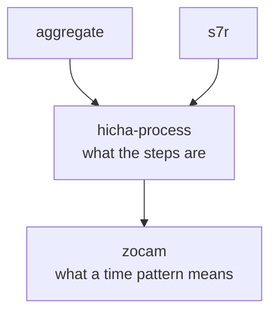

# hicha-process

> **AI SLOP** — an AI agent wrote this page. [yuri4n](https://github.com/yuri4n), a senior
> engineer, gave the direction and did the review. The review is human, thus errors can stay.

A library to describe processes. Nothing is built yet; this page says what the
part is for.

## What this is trying to do

The platform keeps describing the same shape in different words. A study
roadmap is a sequence of steps with prerequisites. A recurring chore is a
sequence of steps with prerequisites. Onboarding at a new job is a sequence of
steps with prerequisites. Each part of the platform has invented its own way to
say it.

This library is the one vocabulary for that shape: **what the steps are, what
must happen before what, and what tells you a step is done.** It describes a
process; it does not run one and it does not schedule one.

The division of labour is the point:

| Part | Answers |
| --- | --- |
| **hicha-process** | What are the steps, and in what order can they happen? |
| **s7r** | When does each step go on the calendar? |
| **zocam** | What does "every second Tuesday" mean as a set of instants? |

Like [zocam](https://github.com/yuri4n/zocam), this is a **public library**. It
must stand on its own and teach through its reference pages.

_Figure 1 — Where the process library sits. It describes shape; the others give it a place in time. AI generated, human reviewed._

## Status

Empty. No code, no decisions recorded, no stack chosen.

One question is open before any code: how much of this already exists inside
s7r. `S7r.Activity`, `S7r.Task`, and `S7r.Dependency` already describe steps and
prerequisites. This library may be an extraction of those, or a separate and
more general thing that s7r comes to depend on. That decision is not made.

## The other repositories

| Repository | What it holds |
| --- | --- |
| [hicha-aggregate](https://github.com/yuri4n/hicha-aggregate) | The centre: reads every source, answers combined questions |
| [hicha-graph](https://github.com/yuri4n/hicha-graph) | Resources, topics, roadmaps |
| [s7r](https://github.com/yuri4n/s7r) | The scheduler: activities, goals, the planner |
| [zocam](https://github.com/yuri4n/zocam) | The time library s7r stands on |
